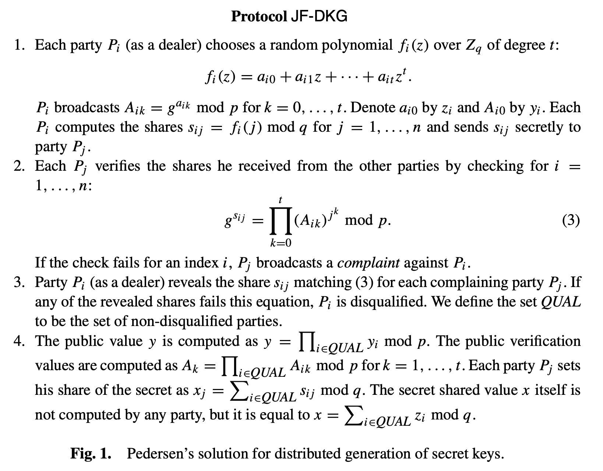

# Distributed Key Generation

> Distributed key generation (DKG) is a main component of threshold cryptosystems. 
> It allows a set of n servers to generate jointly a pair of public and private keys
> without assuming any trusted party. A DKG may be run in the presence of a malicious
> adversary who corrupts a fraction (or threshold) of the parties and forces them to follow
> an arbitrary protocol of their choice. (from [GJKR99 latest revision](https://www.researchgate.net/publication/225722958_Secure_Distributed_Key_Generation_for_Discrete-Log_Based_Cryptosystems))

This codebase implements a slight simplification of Pedersen's DKG from [Ped91](https://link.springer.com/chapter/10.1007/3-540-46416-6_47) (Section 3.1).
GJKR99 called this a "Joint-Feldman DKG" (hereafter called JF-DKG):

## The Broadcast Channel

The protocols require a secure authenticated broadcast channel, which we call the _board_.
Publishing to the board is abstracted via the [`BoardPublisher`](./src/board.rs) trait.

### Supported Boards

Currently `BoardPublisher` is implemented for all `Write` implementers. A simple example of this
use case would be:
1. Each participant publishes their shares to a file (the file is considered to be the board)
1. Each participant uploads their file to a server which acts as an untrusted coordinator
1. Each participant downloads the other participants' encrypted shares from the server

In this case, the coordinator _may_ cause the DKG to halt by rejecting contributions, but they
cannot influence the protocol in any other way beyond the known attacks on JF-DKG.

We may consider switching to [`async-trait`](https://github.com/dtolnay/async-trait) in the future
in order to support asynchronous publication to the board. The trait definition may also change to
allow passing authentication information over the wire on each call.

## Securely Communicating Shares

We assume public key infrastructure. Before the DKG starts, each participant creates a 
keypair and share their public key with each other participant. After evaluating the polynomial
at each participant's index, the shares are encrypted with the corresponding participant's public
key using an [Elliptic Curve Integrated Encryption Scheme](./../threshold-bls/src/ecies.rs) and 
then are sent to the broadcast channel.

## Protocol Choice Note

In [GJKR99], the authors showed that Pedersen's DKG does not generate a secret key with a uniform distribution.
In [GJK02](https://www.researchgate.net/publication/2558744_Revisiting_the_Distributed_Key_Generation_for_Discrete-Log_Based_Cryptosystems) 
the authors revisited Pedersen's DKG and proved that it is safe to instantiate a threshold version of Schnorr's signature
scheme even if the secret key's distribution is not uniform. They also conjecture that this property carries over to 
other threshold cryptosystems whose security reduces to the discret-log assumption. We assume that JF-DKG can be safely
instantiated with a BLS Threshold Signature Scheme.
